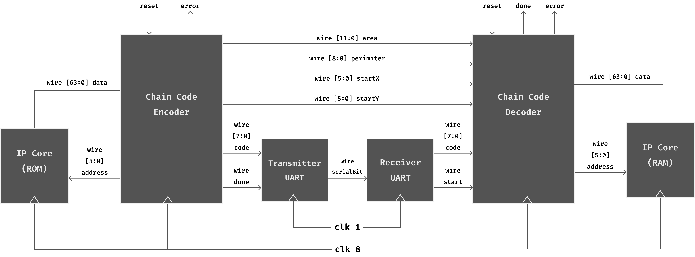

# FPGA Image Encoding and Decoding

## Overview
This project involves the implementation of a computerized digital system for image coding. The focus is on algorithms that encode images using a segmentation approach, with a specific emphasis on the Chain Code algorithm. The project is divided into two main parts: a Python script for generating binary-coded images and a Verilog code for encoding and decoding the Chain Code.

## Key Features
- Python script for binary code generation from black and white images.
- Verilog implementation for Chain Code encoding and decoding.
- Use of ROM and RAM IP cores for storing image data.
- UART communication for efficient data transfer.
- Detailed documentation for understanding and implementation.

## Project Structure
1. **Python Part**
   - Extracts binary code from black and white images.
   - Converts the code into ".coe" file format for initializing IP cores.

2. **Verilog Project**
   - **ROM IP Core:** Stores binary code obtained from Python part.
   - **Encoder Module:**
     - Inputs: reset, clk, start
     - Outputs: code, done, error, perimeter, area, startX, startY
     - State machine with 9 states for Chain Code encoding.

   - **UART Transmitter Module (sender_uart):**
     - Inputs: clk, rst, tx_data (8-bit), ready
     - Outputs: tx_out
     - Sends data serially using UART protocol.

   - **UART Receiver Module (receiver_uart):**
     - Inputs: clk, rst, rx_in
     - Outputs: rx_data (8-bit), ready
     - Receives serial data and outputs parallel data.

   - **Decoder Module:**
     - Inputs: reset, clk, start, code (8-bit), perimeter, area, startX, startY
     - Outputs: pixels, done, error
     - State machine with 7 states for Chain Code decoding.

   - **RAM IP Core:** Stores the regenerated (decoded) binary sequence of the image.

   - **Main Module:**
     - Instantiates and connects all the modules.

## How to Use
1. Generate binary code from a black-and-white image using the Python script.
2. Create ROM and RAM IP cores using the generated ".coe" file.
3. Implement the Verilog modules and instantiate the main module.
4. Ensure proper connections and clock frequency for UART communication.
5. Simulate the design for verification.

**Note:** Ensure that the clock frequency is set appropriately for UART communication.

## Contributors
- Ali Maher
- [Amir Hossein Roodaki](https://github.com/roodaki) 

For detailed information, refer to the project documentation.
